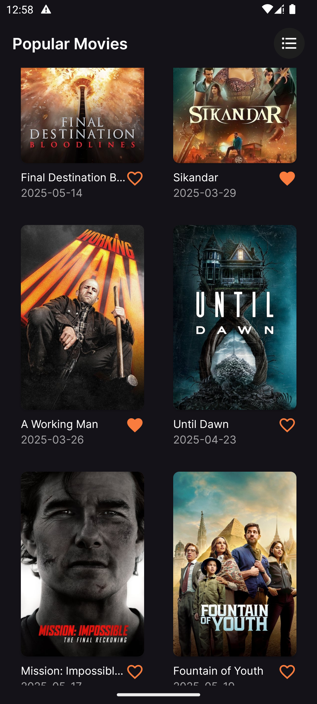
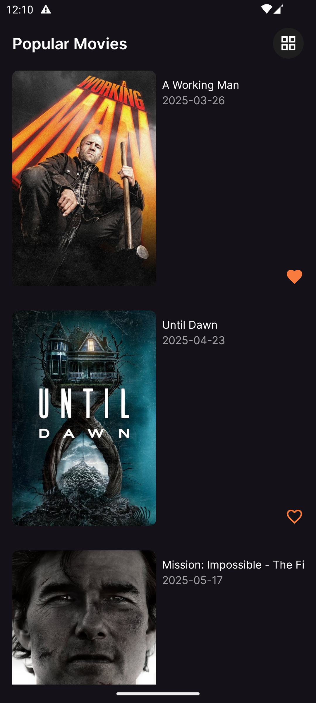

# 🎬 Kotlin Movies App

A modern Android application that displays a list of movies fetched from [TMDb API](https://www.themoviedb.org/), built using Kotlin, MVI architecture, and modern Android libraries.

---
 

## ✨ Features

### 🏠 Home Screen
- Displays a list of movies with **poster**, **title**, and **release date**.
- Toggle between **vertical list** and **grid layout**.
- Supports **pagination** using **Paging 3**.
- Reflects favorite state synced with local storage.

### ⭐ Favorite Functionality
- Users can **mark/unmark** a movie as a favorite.
- Favorites are stored locally using **Room**.
- Favorite status is shown directly in the home list.

### 🎥 Details Screen
- Clicking a movie navigates to a **details screen**.
- Displays:
    - Overview
    - Genres
    - Runtime
    - Other useful metadata
- **Preserves scroll position** when returning to the home list.

### Architecture & Tech Stack
- **MVI** architecture pattern.
- **XML-based layouts**.
- **Kotlin Coroutines** + **Flow** for async tasks.
- **Paging 3** for list loading.
- **Room** for local data storage.
- **Hilt** for dependency injection.
- **Navigation Components** with **single activity architecture**.

### Offline Support
- Users can view previously loaded data and favorites **while offline**.

### Theme Support
- supports **light** and **dark** themes.

---

## Getting Started

To run this app on your local machine:

1. Get a **free API key** from [TMDb](https://www.themoviedb.org/documentation/api).
2. Open your `local.properties` file in the project root and add the following:

   ```properties
   API_KEY=your_api_key_here
   
---
## Future Improvements

- Support for different UI configurations (e.g., landscape mode, tablets).
- Add more metadata to the Movie Details Screen.
- Refactor Movie Details Screen to use the MVI pattern for consistency.
- Add unit tests for ViewModels and business logic.
- Add UI tests for critical user flows.